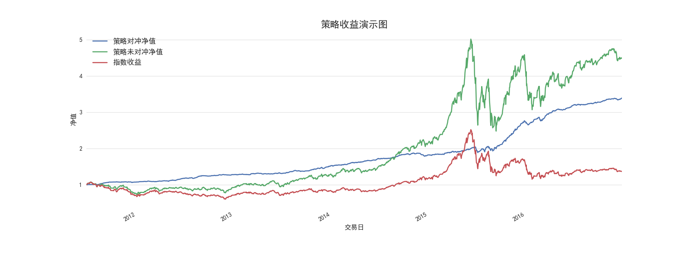

-

## 动态情景多因子模型
Dynamic Contextual Alpha Model

参考文献: 朱剑涛, 动态情景多因子Alpha模型----因子选股系列研究之八，东方证券, 2016

### 模型简介
传统多因子Alpha策略存在以下两个方面的问题
*  对每个股票采用同一评判标准，无法区分个股的特征：实际上每只股票具有其独有的特征， 如市值特征，成长性特征
*  忽视了因子的分层效应

因子的独有特征以及分层效应，使得因子具有非线性的特征，而传统多因子Alpha策略使用的因子打分平均加权体系依赖于因子线性特征的假设。这一矛盾使得传统多因子Alpha策略具有持续偏重某种风格（如小市值股票），回撤较大的缺点。

动态情景多因子策略放弃了因子打分平均加权的做法
*  通过分层再加权的方式，构建了立体的打分模式，使得选择的股票组合不会持续偏向某一风格
*  每个分层因子下的Alpha因子的权重根据过去一段时间的IC系数动态调整，能更灵敏捕捉市场的风格变化，降低策略的回撤

本项目试图复制参考文献中的动态情景多因子Alpha模型， 以检验其效果

### 动态情景Alpha模型的构建
#### 情景分层因子介绍
我们挑选出情景分层因子如下：

| 风格维度 |因子名称和含义 |原始数据频率|来源|
|---|:---|:---|:---|
|规模|总市值|月度频率|wind|
|价值|最近财报的净资产/总市值|季度频率|wind|
|成长|净资产同比增长率|季度频率|wind|
|盈利|净资产收益率|季度频率|wind|
|流动性水平|季度日均换手率|月度频率|wind|

#### 情景Alpha因子介绍
正如前面所言，同样的因子在不同的情景分层中，有不同的表现。所以有必要给予不同情况下，给予不同的权重。本策略采用因子过去12个月的风险调整IC的均值除以标准差作为因子加权的依据。参考原文，并从数据提取的方便程度考虑，最后挑选的因子如下：

| 因子名称 |因子定义 |原始数据频率|来源|
|---|:---|:---|:---|
|BP_LF|最近财报的净资产/总市值|季度频率|wind|
|EP2_TTM|剔除非经常性损益的过去12个月净利润/总市值|季度频率|wind|
|SP_TTM|过去12个月总营业收入/总市值|季度频率|wind|
|GP2Asset|销售毛利润/总资产|季度频率|wind|
|PEG|TTM PE/预测未来2年净利润复合增长率|月度频率|朝阳永续|
|ProfitGrowth_Qr_YOY|净利润同比增长率（季度同比）|季度频率|wind|
|PPReversal|5日均价/60日成交均价|月度频率|wind|
|TP_adj|以流通股本计算的20日日均换手率|月度频率|wind|

## 回测结果
回测区间： 2010.6 - 2016.12
对冲标的：中证500指数
组合风格：中证500行业中性
调仓频率： 月度

### 策略对冲净值图

### 策略对冲收益统计

|  |2011 |2012|2013|2014|2015|2016|
|---|:---|:---|:---|:---|:---|:---|
|annual_return|0.1503|0.1994|0.1940|0.2102|0.5370|0.2399|
|calmar_ratio |8.5033|12.9047|8.4152|4.6153|7.0017|6.7773|
|max_drawdown |-0.0177|-0.0155|-0.0231|-0.0455|-0.0767|-0.0354|
|sharpe_ratio |3.3574|4.3193|3.6265|4.2014|3.9902|4.2804|

### 策略未对冲收益统计

|  |2011 |2012|2013|2014|2015|2016|
|---|:---|:---|:---|:---|:---|:---|
|annual_return|-0.4110|0.2116|0.4087|0.6890|1.1691|-0.0008|
|calmar_ratio |-1.3917|1.2318|2.6888|7.9698|2.3097|-0.0030|
|max_drawdown |-0.2953|-0.1718|-0.1520|-0.0864|-0.5062|-0.2548|
|sharpe_ratio |-2.0324|0.9371|1.6789|2.6409|1.7646|0.1686|

注：sharpe比例计算中假设无风险利率为0
## 如何使用

###### 因子数据的加载
将本主页的另一个项目pyStratData下的数据文件
<pre> pyStratData/AlphaData/data.zip </pre>
拷贝至本项目如下目录即可
<pre> pyStratAlpha/data/</pre>

###### 策略模块的运行
<pre>pyStratAlpha/strat/alpha/pseudoDCAM.py</pre>

